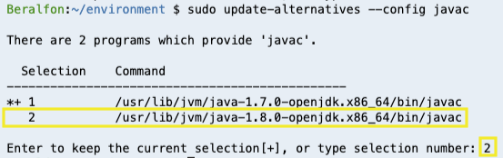
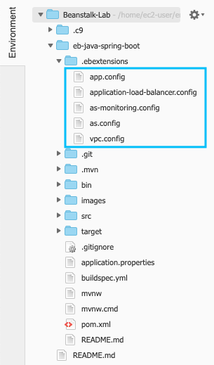

# Deploying Java Application with AWS Elastic Beanstalk

[!embed?max_width=1200](https://www.youtube.com/watch?v=SrwxAScdyT0)

## 1. Create a VPC with public and private subnets using AWS CloudFormation

1.1\. Download the [CloudFormation template AURBAC-VPC-Public-And-Private.json](scripts/AURBAC-VPC-Public-And-Private.json), we are going to use it to create the network environment.

1.2\. Open the AWS CloudFormation console at https://console.aws.amazon.com/cloudformation.
  
1.3\. In **Stacks** section choose **Create Stack**.


1.4\. In the **Create stack** section, select **Template is ready**, select **Upload a template file** and **Choose file** for the template downloaded **AURBAC-VPC-Public-And-Private.json** and click **Next**.


1.5\. In the **Specify stack details** section, for **Stack name** type `My-VPC` to identify the cloudformation stack, scroll down and click **Next**.


1.6\. For the **Configure stack options** section choose **Next**.

1.7\. For the **Review My-VPC** section click on **Create Stack**.

1.8\. It will take about 5 minutes while your stack is being created, it is listed on the **Stacks** page with a status of **CREATE_IN_PROGRESS**.

1.9\. After your stack has been successfully created, its status changes to **CREATE_COMPLETE**. You can then click the **Outputs** tab to view your stack's outputs required for the following configurations.


## 2. Install requirements and clone Github project

2.1\. Open the AWS Cloud9 console at https://console.aws.amazon.com/cloud9/.

2.2\. In the list of environments, for the environment you want to open, inside of the card, choose **Open IDE**.


2.3\. Install the Elastic Beanstalk Command Line Interface (EB CLI).

``` bash
pip install awsebcli --upgrade --user
```

2.4\. Install OpenJDK 8.

``` bash
sudo yum -y install java-1.8.0-openjdk-devel
```

2.5\. Switch or upgrade the default Java development toolset to OpenJDK 8.

``` bash
sudo update-alternatives --config java
```


``` bash
sudo update-alternatives --config javac
```



2.6\. Confirm that the command line versions of the Java runner and compiler are using OpenJDK 8.

``` bash
java -version
javac -version
```

2.7\. Install Maven.

``` bash
sudo wget http://repos.fedorapeople.org/repos/dchen/apache-maven/epel-apache-maven.repo -O /etc/yum.repos.d/epel-apache-maven.repo
sudo sed -i s/\$releasever/6/g /etc/yum.repos.d/epel-apache-maven.repo
sudo yum install -y apache-maven
```

2.8\. Clone Github project.

``` bash
git clone https://github.com/aurbac/eb-java-spring-boot.git
cd eb-java-spring-boot
```

2.9\. Build the java project.

``` bash
mvn package
```


## 3. Environment Customization with Configuration Files (.ebextensions)

3.1\. Inside the project you will find some configuration files (.ebextensions) to your web application's source code to configure your environment and customize the AWS resources that it contains. 



Complete reference: https://docs.aws.amazon.com/elasticbeanstalk/latest/dg/ebextensions.html

3.2\. Configure VPC/Subnets replacing values in **.ebextensions/vpc.config** with the resources created by the CloudFormation template or your own vpc and subnet, remember to **save the file**.

* **VPCId** with your VpcId output value.
* **ELBSubnets** with your PublicSubnetId01 and PublicSubnetId02 output values.
* **Subnets** with you PrivateSubnetId01 and PrivateSubnetId02 output values.


3.3 For Java applications is required to create a source bundle that includes the **jar** application and **.ebextensions** folder.

``` bash
cp .ebextensions target/.ebextensions -r
cd target
zip ExampleJava-0.0.1-SNAPSHOT.zip -ur .ebextensions ExampleJava-0.0.1-SNAPSHOT.jar
cd ..
```

3.4\. Commit changes to the local git repository.

``` bash
git config --global user.name "Your Name"
git config --global user.email you@example.com
git add .
git commit -m "Changes for VPC and subnets"
```

## 4. Deploying your Java Application

4.1\. Initialize Elastic Beanstalk project.

``` bash
eb init
```

Select a default region: **1) us-east-1 : US East (N. Virginia)**

Select an application to use: **1) eb-java-spring-boot**

Select a platform. **11) Java**

Select a platform version. **1) Java 8**

Do you wish to continue with CodeCommit? **N**

Do you want to set up SSH for your instances? **Y**

Select a keypair. **(Select your KeyPair)**

4.2\. Open **.elasticbeanstalk/config.yml** file and add a **deploy** config at the end of the file, remember to **save the file**.

``` yaml
deploy:
  artifact: target/ExampleJava-0.0.1-SNAPSHOT.zip
```


4.3\. Create your first environment.

``` bash
eb create
```

Enter Environment Name: **(use the default value)**

Enter DNS CNAME prefix: **my-name-java-spring-boot-dev (Unique value)**

Select a load balancer type: **2) application**

Wait a few minutes until your environment is launched.


4.4\. Open the AWS Elastic Beanstalk console at  https://console.aws.amazon.com/elasticbeanstalk and click on your **eb-java-spring-boot-dev** environment.


4.5\. Choose the site URL to open your website in a new tab.

