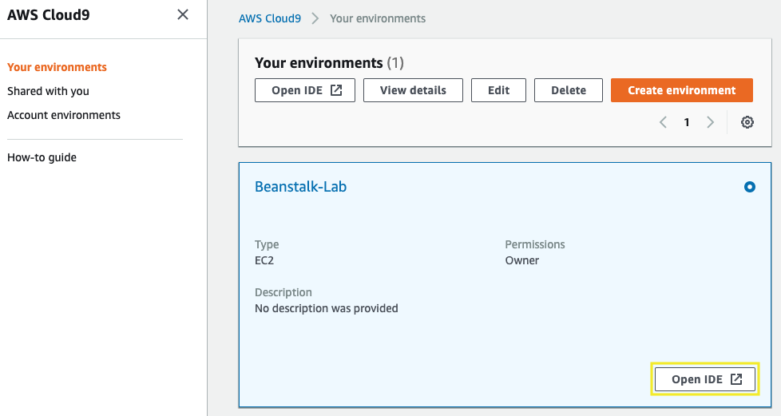
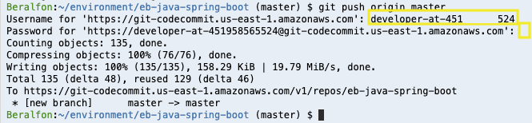
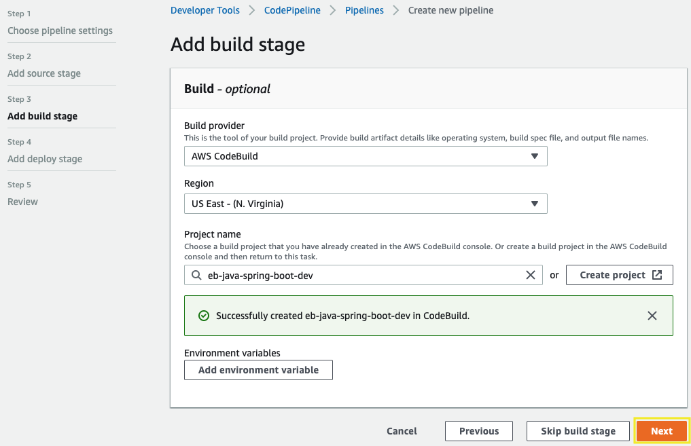
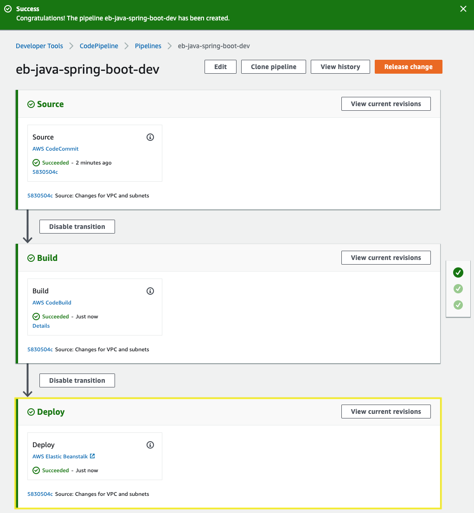

# Deploying with AWS CodePipeline to AWS Elastic Beanstalk

[!embed?max_width=1200](https://www.youtube.com/watch?v=YxcIj_SLflw)

## 1. Create a CodeCommit repository 

1.1\. Open the CodeCommit console at https://console.aws.amazon.com/codesuite/codecommit/home.

1.2\. On the Repositories page, choose **Create repository**.


1.3\. On the **Create repository** page, type `eb-java-spring-boot` for **Repository name** and choose **Create**.


1.4\. Click on **Clone URL** and choose **Clone HTTPS**, the URL is copied, save it, you will use later.


## 2. Connect to CodeCommit and push changes to Git repository

2.1\. Open the AWS Cloud9 console at https://console.aws.amazon.com/cloud9/.

2.2\. In the list of environments, for the environment you want to open, inside of the card, choose **Open IDE**.



2.3\. Inside the Cloud9 environment, in the **bash** terminal go inside **eb-java-spring-boot** folder and remove remote from git project.

``` bash
cd ~/environment/eb-java-spring-boot/
git remote remove origin
```

2.4\. Use your URL repository to add your new origin.

``` bash
export MY_REGION=`aws configure get region`
git remote add origin https://git-codecommit.$MY_REGION.amazonaws.com/v1/repos/eb-java-spring-boot
```

2.5\. Push the project to your repository using the HTTPS Git Credentials.

``` bash
git push origin master
```



## 3. Create your CodePipeline

3.1\. Open the AWS CodePipeline console at http://console.aws.amazon.com/codesuite/codepipeline/home.

3.2\. On the **Pipelines** page, choose **Create pipeline**.


3.3\. In **Step 1: Choose pipeline settings**, in **Pipeline name**, enter `eb-java-spring-boot-dev` and choose **Next**.


3.4\. In **Step 2: Add source stage**, in **Source provider**, choose **AWS CodeCommit**, For the **Repository name** select **eb-java-spring-boot** and for **Branch name** select **master**. Choose **Next**.


3.5\. In **Step 3: Add build stage**, select **AWS CodeBuild** and choose **Create project**.


3.6\. For **Create build project** window, complete as follows and choose **Continue to CodePipeline**:

* **Project name**: **``eb-java-spring-boot-dev``**
* **Operating system**: Select **``Amazon Linux 2``**
* **Runtime(s)**: Select **``Standard``**
* **Image**: Select **``aws/codebuild/amazonlinux2-x86_64-standard:1.0``**
* **Image version**: select **``Always use the latest image for this runtime version``**
* **Privileged**: check **``Enable this flag if you want to build Docker images or want your builds to get elevated privileges``**


!!! info
    Inside the Java project exists a file called **buildspec.yml** that contains a collection of build commands and related settings, in YAML format, that CodeBuild uses to run a build. https://docs.aws.amazon.com/codebuild/latest/userguide/build-spec-ref.html

3.7\. Choose **Next**.



3.8\. In **Step 4: Add deploy stage**, choose **Amazon ECS**, for the **Cluster name** select **backend-cluster** and for **Service name** select **backend**, and choose **Next**.


3.9\. In **Step 5: Review**, review the information, and then choose **Create pipeline**.

