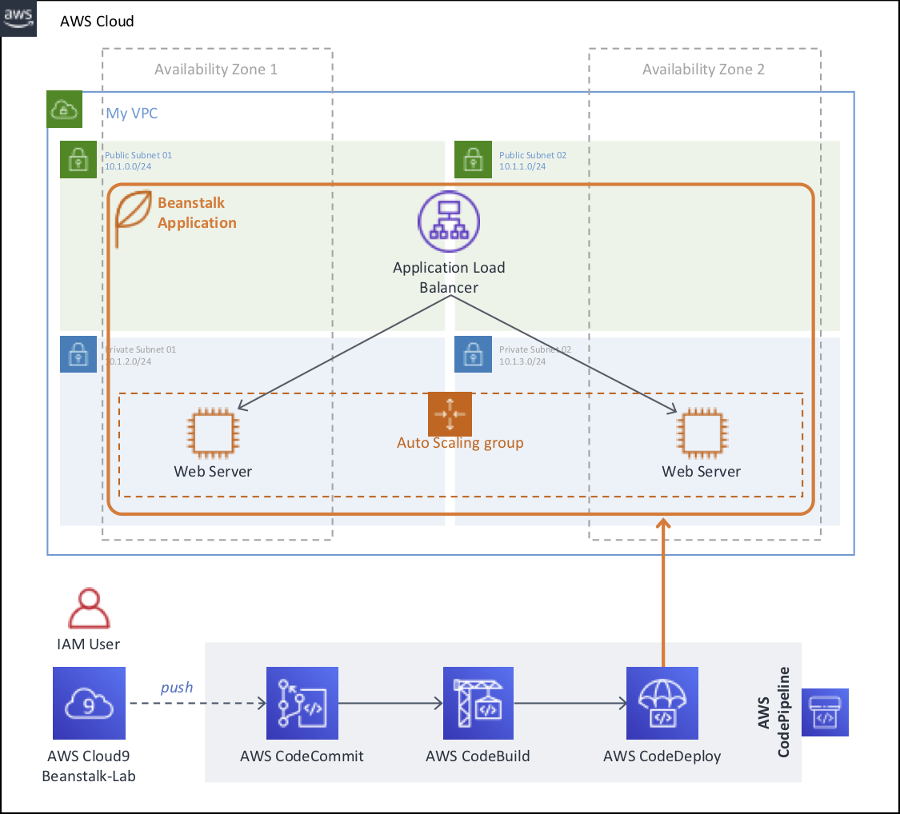

# Deploying a Java Application using AWS Elastic Beanstalk with CI/CD

Hello, this is a self-paced workshop to deploy a Scalable Java Application using AWS Elastic Beanstalk with continuous deployment enabled by using AWS CodePipeline.

See the diagram below for a depiction of the complete architecture.

## AWS Account Required

In order to complete these workshops you'll need a valid active AWS Account with Admin permissions. Use a personal account or create a new AWS account to ensure you have the neccessary access. This should not be an AWS account from the company you work for.

**If the resources that you use for this workshop are left undeleted you will incur charges on your AWS account.**

You must complete the following modules in **US East (N. Virginia)** region in order before proceeding to the next.