# Preparing your development environment

[!embed?max_width=1200](https://www.youtube.com/watch?v=JDHZOGMMkj8)

## 1. Create an IAM User with administrator privileges

1.1\. Open the IAM console at https://console.aws.amazon.com/iam/.

1.2\. Choose **Users**, then **Add user**.

1.3\. Type a name for your user `developer`, choose **Programmatic access** and click **Next: Permissions**.

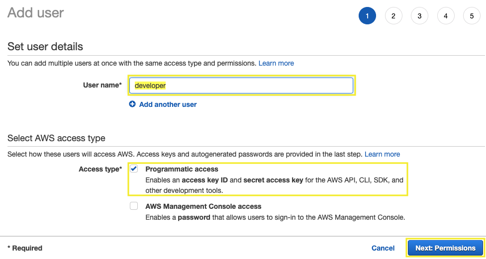

1.4\. Click **Attach permissions policies** and select **Administrator Access**, choose **Next: Tags**.

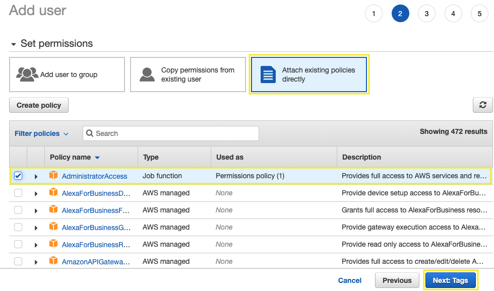

1.5\. For **Add tags (optional)** section choose **Next: Review**.

1.6\. Click on **Create user**.

1.7\. To save the credentials, choose **Download .csv** and then save the file to a safe location, and **Close**.

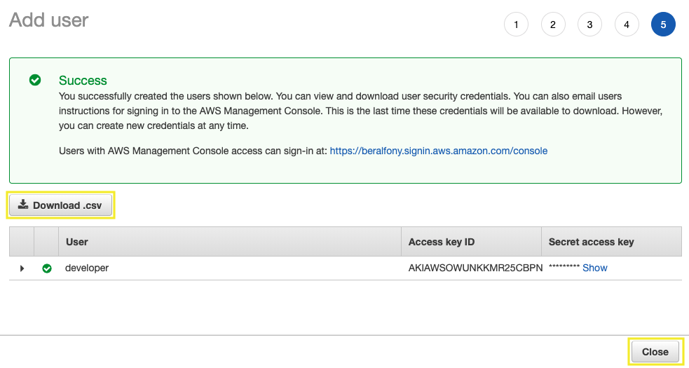

## 2. Create HTTPS Git credentials for AWS CodeCommit

2.1\. From the users list, click on **developer** user.

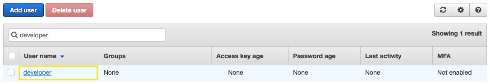

2.2\. On the user details page, choose the **Security Credentials** tab, and in **HTTPS Git credentials for AWS CodeCommit**, choose **Generate**.

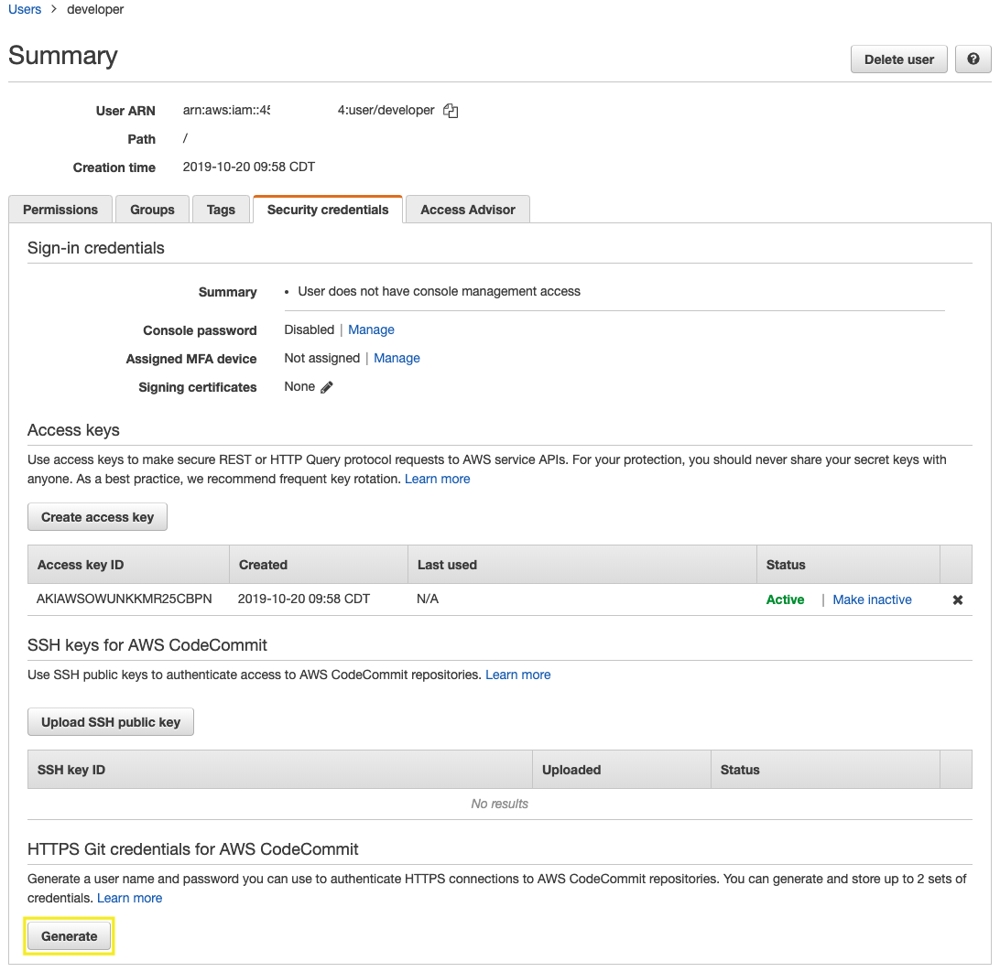

2.3\. Copy the user name and password that IAM generated for you, either by showing, copying, and then pasting this information into a secure file on your local computer, or by choosing **Download credentials** to download this information as a .CSV file.

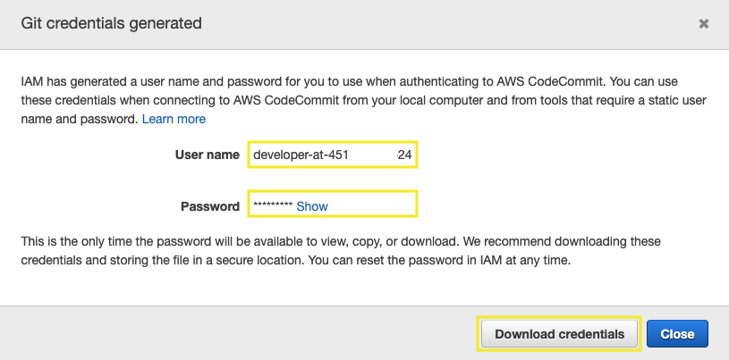

## 3. Create a Cloud9 instance for development

3.1\. Open the AWS Cloud9 console at https://console.aws.amazon.com/cloud9/.

3.2\. Click on **Create environment**.

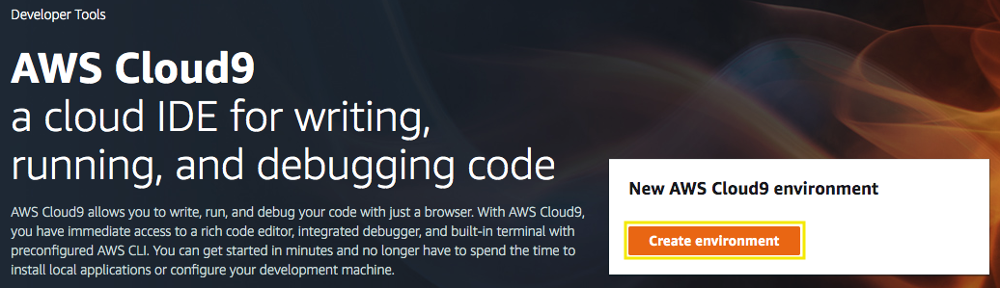

3.3\. For the **Name** type `Beanstalk-Lab`, and choose **Next step**.

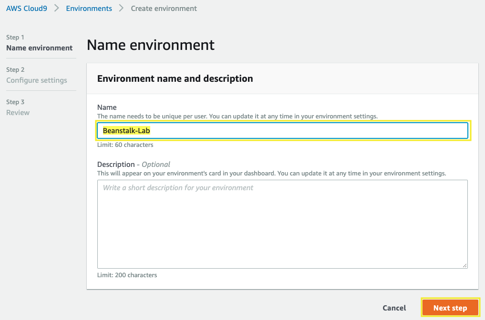

3.4\. For the **Configure settings** section, select the instance type **t2.small** and choose **Next step**.

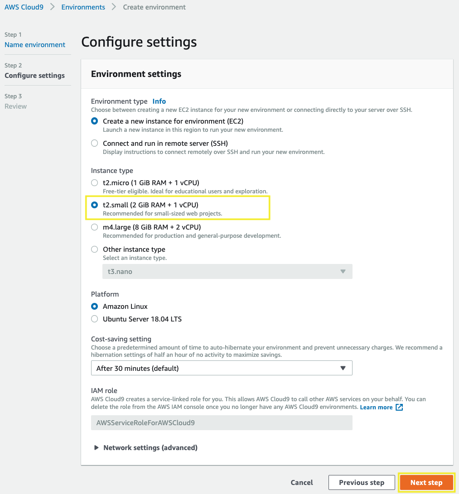

3.5\. For the **Review** section click on **Create environment**.

3.6\. Wait a few seconds until your development environment is ready, you will see the following screen.

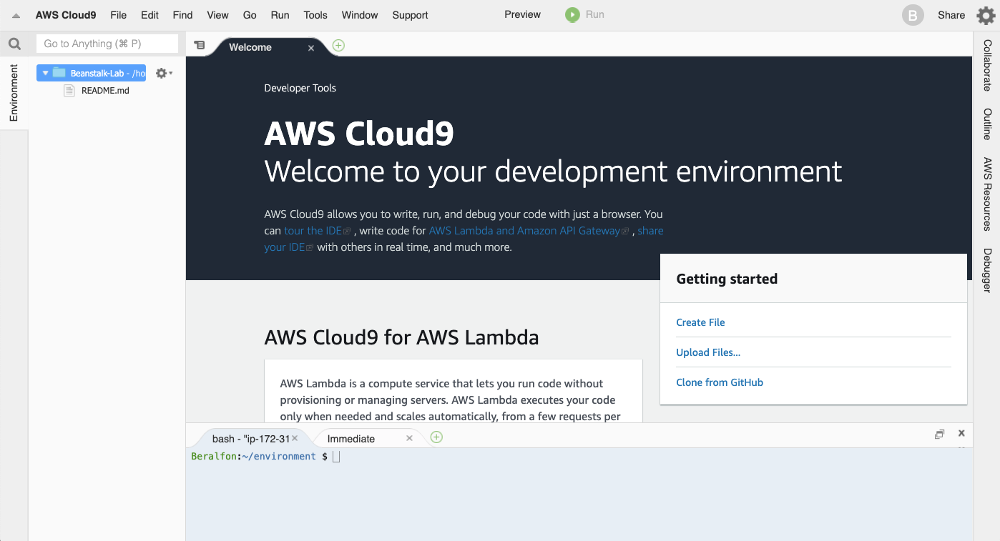

3.7\. For this lab is required to see hidden files, click on preference icon and click on **Show Hidden Files**.

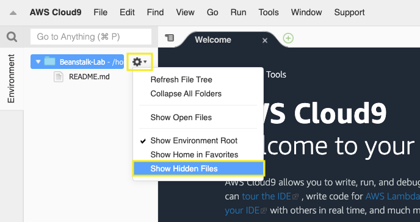

## 4. Update IAM settings for your Cloud9 environment

4.1\. Inside the Cloud9 environment, click on **AWS Cloud9** and **Preferences**.

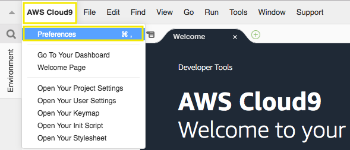

4.2\. Select **AWS SETTINGS** and turn off **AWS managed temporary credentials**.

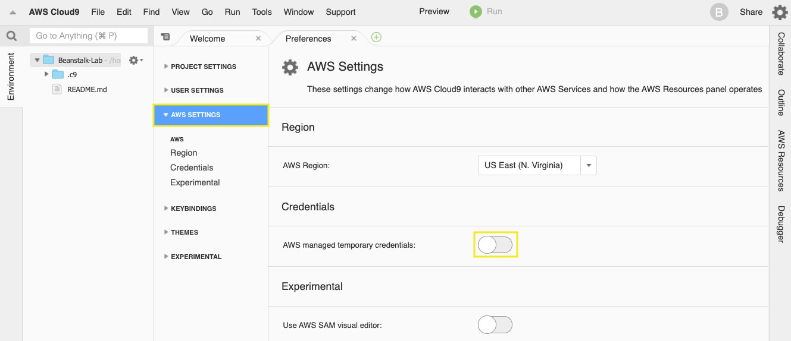

## 5. Configure your AWS CLI

5.1\. Clear credential files.

``` bash
rm ~/.aws/config
rm ~/.aws/credentials
```

5.2\. Inside the Cloud9 environment, in the **bash** terminal we are going to configure the AWS CLI as follows:

``` bash
aws configure
```

- Configuration:
    - AWS Access Key ID: **(Type your Access key ID)**
    - AWS Secret Access Key: **(Type your Secret access key)**
    - Default region name [None]: **(Use your region code, example: us-east-1)** [All Regions](https://docs.aws.amazon.com/AWSEC2/latest/UserGuide/using-regions-availability-zones.html#concepts-available-regions)
    - Default output format [None]: **json**

5.3\. Remove **aws_session_token** variable from aws credentials.

``` bash
sed -i 's/aws_session_token =//g' ~/.aws/credentials
```

